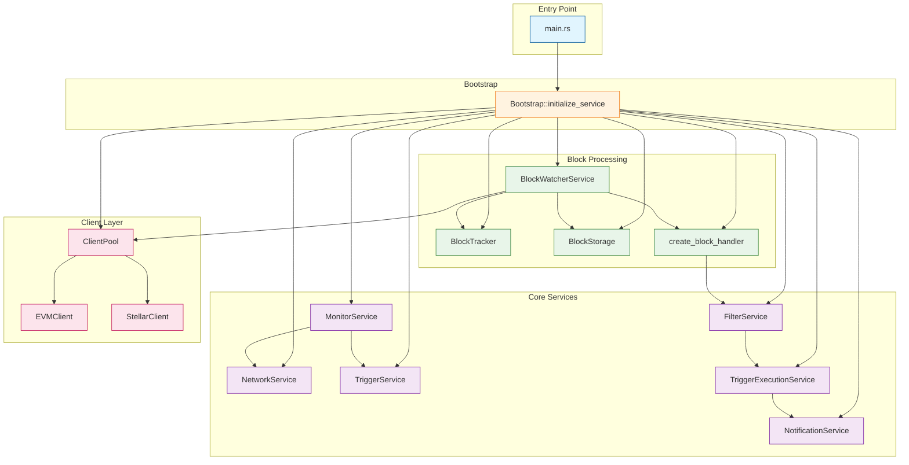

# OpenZeppelin Monitor

[](https://codecov.io/gh/OpenZeppelin/openzeppelin-monitor)
[](https://api.securityscorecards.dev/projects/github.com/OpenZeppelin/openzeppelin-monitor)
[](https://github.com/OpenZeppelin/openzeppelin-monitor/actions/workflows/cla.yml)
[](https://github.com/OpenZeppelin/openzeppelin-monitor/actions/workflows/ci.yaml)
[](https://github.com/OpenZeppelin/openzeppelin-monitor/actions/workflows/release-please.yml)

In the rapidly evolving world of blockchain technology, effective monitoring is crucial for ensuring security and performance. OpenZeppelin Monitor is a blockchain monitoring service that watches for specific on-chain activities and triggers notifications based on configurable conditions. The service offers multi-chain support with configurable monitoring schedules, flexible trigger conditions, and an extensible architecture for adding new chains.

[Install](https://docs.openzeppelin.com/monitor#getting_started) | [User Docs](https://docs.openzeppelin.com/monitor) | [Quickstart](https://docs.openzeppelin.com/monitor/quickstart) | [Crate Docs](https://docs.openzeppelin.com/monitor/rust_docs/doc/openzeppelin_monitor/)

## Features

- **Real-time Monitoring**: Watch blockchain networks in real-time for specific events and transactions
- **Smart Filtering**: Use flexible expressions to define exactly what you want to monitor
- **Multi-notification Support**: Send alerts via Slack, Discord, Email, Telegram, Webhooks, or custom scripts
- **Configurable Scheduling**: Set custom monitoring schedules using cron expressions
- **Data Persistence**: Store monitoring data and resume from checkpoints
- **Extensible Architecture**: Easy to add support for new blockchains and notification types

## Supported Networks

- **EVM-Compatible Networks**
- **Stellar**

## Notification Channels

- **Slack** - Send formatted messages to Slack channels
- **Discord** - Post alerts to Discord channels via webhooks
- **Email** - Send email notifications with SMTP support
- **Telegram** - Send messages to Telegram chats via bot API
- **Webhooks** - Send HTTP requests to custom endpoints
- **Custom Scripts** - Execute Python, JavaScript, or Bash scripts

## For Users

### Installation

- View the [Installation](https://docs.openzeppelin.com/monitor#getting_started) documentation for detailed information. For a quicker introduction, check out the [Quickstart](https://docs.openzeppelin.com/monitor/quickstart) guide.

- As a Pre-requisite, copy example configuration files to `./config` directory and modify according to your needs. See [examples](https://docs.openzeppelin.com/monitor/quickstart#examples) for more information.

### Usage

View the [Usage](https://docs.openzeppelin.com/monitor#running_the_monitor) documentation for more information.

## For Developers

### Technical Overview

The following diagram illustrates the architecture of the monitoring service, highlighting key components and their interactions.



### Project Structure

```sh
openzeppelin-monitor/
├── src/                # Source code
│   ├── bootstrap/      # Bootstrap functions for the application
│   ├── models/         # Data structures and types
│   ├── repositories/   # Configuration storage
│   ├── services/       # Core business logic
│   ├── utils/          # Helper functions
│
├── config/             # Configuration files
├── tests/              # Integration and property-based tests
├── data/               # Runtime data storage
├── docs/               # Documentation
├── scripts/            # Utility scripts
├── cmd/                # Metrics and monitoring
├── examples/           # Example configuration files
└── ... other root files (Cargo.toml, README.md, etc.)
```

### Development Environment Setup

#### Linux

To get started on Ubuntu 22.04+ or Debian-based systems (both x86 and ARM64 architectures):

**Note:** Python 3.9+ is required for pre-commit hooks compatibility.

```bash
# Install required packages directly
sudo apt update
sudo apt install -y \
    build-essential \
    curl \
    git \
    pkg-config \
    libssl-dev \
    libffi-dev \
    libyaml-dev \
    python3 \
    python3-venv \
    python3-pip
```

or run the linux system package script (automatically ensures Python 3.9+ compatibility):

```bash
chmod +x ./scripts/linux/sys_pkgs_core.sh
chmod +x ./scripts/linux/sys_pkgs_dev.sh
# Installs required packages and ensures compatible Python version
./scripts/linux/sys_pkgs_core.sh   # For runtime dependencies only
./scripts/linux/sys_pkgs_dev.sh    # For Python/dev dependencies (calls core script)
```

#### Prerequisites

- **Rust 2021 edition**, version `1.86` or later.
- **Git** for version control
- **Python/pip** for pre-commit hooks

#### Initial Setup

```bash
# Clone the repository
git clone https://github.com/openzeppelin/openzeppelin-monitor
cd openzeppelin-monitor

# Build the project
cargo build

# Set up environment variables
cp .env.example .env
```

#### Install Pre-commit Hooks

**Required for code quality checks** including `rustfmt`, `clippy`, and commit message validation.

```bash
# Install pre-commit (use pipx for global installation if preferred)
pip install pre-commit

# Install and configure hooks for commit-msg, pre-commit, and pre-push
pre-commit install --install-hooks -t commit-msg -t pre-commit -t pre-push
```

> :warning: If you encounter issues with pip, consider using [pipx](https://pipx.pypa.io/stable/installation/) for a global installation.

#### Install Rust Toolchain Components

```bash
rustup component add rustfmt
```

### Run Tests

To run tests, use the following commands:

```bash
RUST_TEST_THREADS=1 cargo test
RUST_TEST_THREADS=1 cargo test properties
RUST_TEST_THREADS=1 cargo test integration
```

### Generate Test Coverage Report

_Interactive HTML Report_

```sh
RUST_TEST_THREADS=1 cargo +stable llvm-cov --html --open
```

_CLI Report_

```sh
RUST_TEST_THREADS=1 cargo +stable llvm-cov
```

## Important Considerations

### Performance Considerations

- Monitor performance depends on network congestion and RPC endpoint reliability.
- The `max_past_blocks` configuration is critical:
  - Calculate as: `(cron_interval_ms/block_time_ms) + confirmation_blocks + 1` (defaults to this calculation if not specified).
  - Example for 1-minute Ethereum cron: `(60000/12000) + 12 + 1 = 18 blocks`.
  - Too low settings may result in missed blocks.
- Trigger conditions are executed sequentially based on their position in the trigger conditions array. Proper execution also depends on the number of available file descriptors on your system. Ideally, you should increase the open file descriptor limit to at least 2,048 or higher for optimal performance.
  - Security Risk: Only run scripts that you trust and fully understand. Malicious scripts can harm your system or expose sensitive data. Always review script contents and verify their source before execution.
  - HTTP requests to RPC endpoints may consume file descriptors for each connection. The number of concurrent connections can increase significantly when processing blocks with many transactions, as each transaction may require multiple RPC calls.

### Notification Considerations

- Email notification port defaults to 465 if not specified.
- Template variables are context-dependent:
  - Event-triggered notifications only populate event variables.
  - Function-triggered notifications only populate function variables.
  - Mixing contexts results in empty values.

## Contributing

We welcome contributions from the community! Before contributing, please note these requirements:

### Key Requirements

- **Contributor License Agreement (CLA)**: All contributors must sign the CLA before contributing
- **GPG-signed commits**: All commits must be GPG-signed for security
- **Pre-commit hooks**: Required for code quality checks including `rustfmt`, `clippy`, and commit message validation

### Getting Started

1. Fork the repository
2. Clone your fork and set up development environment
3. Install pre-commit hooks
4. Create your feature branch
5. Make your changes with proper testing
6. Submit a Pull Request

If you are looking for a good place to start, find a good first issue [here](https://github.com/openzeppelin/openzeppelin-monitor/issues?q=is%3Aissue%20is%3Aopen%20label%3Agood-first-issue).

You can open an issue for a [bug report](https://github.com/openzeppelin/openzeppelin-monitor/issues/new?assignees=&labels=T-bug%2CS-needs-triage&projects=&template=bug.yml), [feature request](https://github.com/openzeppelin/openzeppelin-monitor/issues/new?assignees=&labels=T-feature%2CS-needs-triage&projects=&template=feature.yml), or [documentation request](https://github.com/openzeppelin/openzeppelin-monitor/issues/new?assignees=&labels=T-documentation%2CS-needs-triage&projects=&template=docs.yml).

For complete details including GitHub workflow, labeling guidelines, and advanced topics, see our [Contributing](CONTRIBUTING.md) guide.

Please read our [Code of Conduct](CODE_OF_CONDUCT.md) and check the [Security Policy](SECURITY.md) for reporting vulnerabilities.

## License

This project is licensed under the GNU Affero General Public License v3.0 - see the [LICENSE](LICENSE) file for details.

## Security

For security concerns, please refer to our [Security Policy](SECURITY.md).

## Get Help

If you have any questions, first see if the answer to your question can be found in the [User Documentation](https://docs.openzeppelin.com/monitor).

### Community Support

- **Telegram**: [Join our community chat](https://t.me/openzeppelin_tg/4) for help and discussions
- **GitHub Issues**: Open a [bug report](https://github.com/openzeppelin/openzeppelin-monitor/issues/new?assignees=&labels=T-bug%2CS-needs-triage&projects=&template=bug.yml) or [feature request](https://github.com/openzeppelin/openzeppelin-monitor/issues/new?assignees=&labels=T-feature%2CS-needs-triage&projects=&template=feature.yml)
- **Good First Issues**: [Find beginner-friendly issues](https://github.com/openzeppelin/openzeppelin-monitor/issues?q=is%3Aissue+is%3Aopen+label%3Agood-first-issue)
- **GitHub Discussions**: For questions and community interaction

We encourage you to reach out with any questions or feedback.

## Maintainers

See [CODEOWNERS](CODEOWNERS) file for the list of project maintainers.
